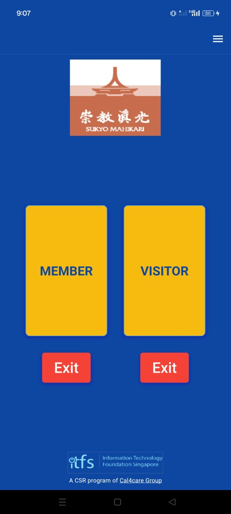

# Sukio Mahikari Master

## Introduction

The Sukio Mahikari Master App is designed for administrators responsible for managing the check-in and check-out process of visitors at various venues. It provides tools and features to ensure smooth and efficient attendance management for spiritual gatherings, community events, or any other occasion.

With the Sukio Mahikari Master App, administrators can effortlessly monitor and track visitor attendance, allowing for better organization and coordination of events. The intuitive interface and powerful functionalities empower administrators to efficiently manage large crowds, maintain accurate attendance records, and enhance the overall experience for both visitors and organizers.

From generating unique QR codes for seamless check-in processes to accessing real-time attendance data and analytics, the Sukio Mahikari Master App equips administrators with everything they need to effectively oversee events and ensure a memorable and enjoyable experience for all participants.

## Prerequisites
- Available only in Android devices

## Getting Started
- **Request Account** Request an account to the super admin
- **Login** Once your account request is approved, log in using the provided username and password.

    

        
    

- **Dashboard** Upon successful login, access the dashboard where members and visitors can scan QR codes or fill out forms for check-in and check-out.

    

        
    

    **Member Check-In Button**: This function creates a unique QR code solely for registered users of the Sukio Member application, granting them smooth entry into the venue. After scanning the QR code, the page automatically redirects back to the dashboard. If there's no scan within 2 minutes, it also returns to the dashboard, ensuring efficiency in managing check-ins.

    

        
    

    **Exit Button for Member** Positioned below the Member button, this feature provides a convenient option for members to check out whenever needed. Simply clicking the exit icon in the designated column enables members to efficiently complete the check-out process.

    

        
    

    **Visitor Check-In Button**: This functionality caters to visitors without accounts in the sukio member app. It offers a form on the page where they can input necessary details to complete the check-in process.

    

        
    
